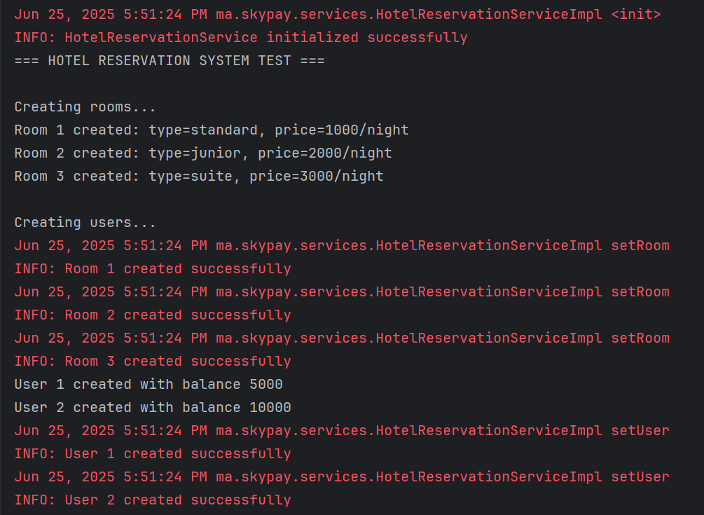
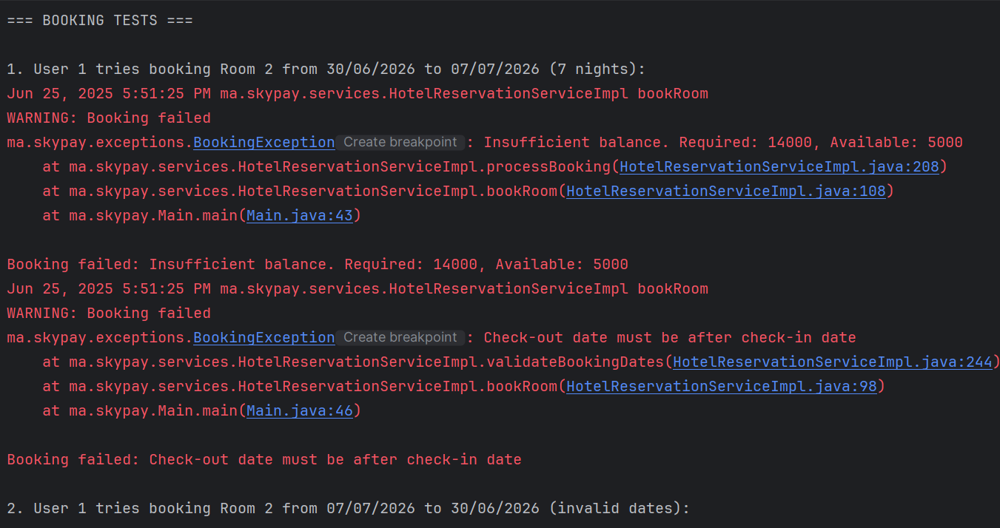
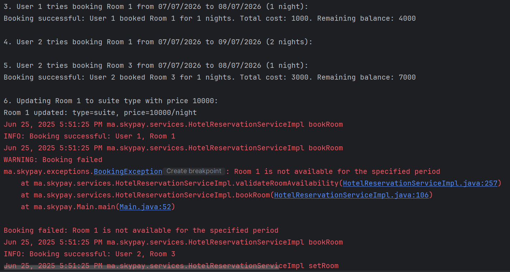
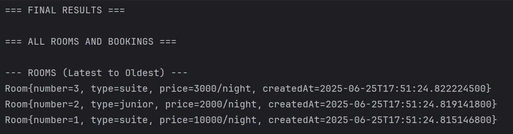
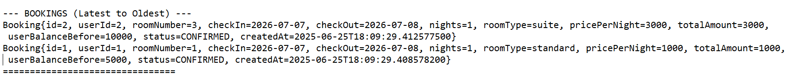
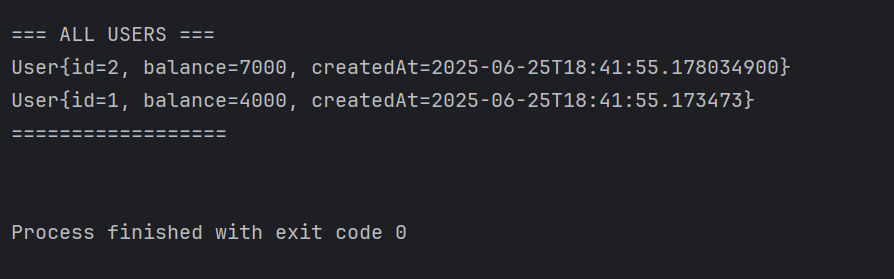

#  Hotel Reservation System — Test Technique Skypay

Ce projet est une implémentation Java d’un mini-système de réservation d’hôtel

---

##  Fonctionnalités

- Ajout de chambres avec type et prix
- Ajout d’utilisateurs avec solde
- Réservation de chambre si :
    - Le solde de l’utilisateur est suffisant
    - La chambre est disponible pendant la période
    - Les dates sont valides
- Mise à jour du type/prix d’une chambre sans affecter les réservations existantes
- Affichage :
    - Liste des chambres et réservations (du plus récent au plus ancien)
    - Liste des utilisateurs

---

## 🛠 Technologies utilisées

- Java 17
- API Date/Time moderne (`LocalDate`, `LocalDateTime`)
- Collections (`ArrayList`)
- Bonnes pratiques : Clean Code, Enum, Exceptions personnalisées, Factory Pattern

---

## ✅ Cas de test implémentés

1. Création de 3 chambres : standard, junior suite, master suite
2. Création de 2 utilisateurs avec solde initial
3. Réservations :
    - Réussie si solde et disponibilité OK
    - Échec si dates invalides ou solde insuffisant
4. Mise à jour du type/prix d’une chambre
5. Affichage final de toutes les données

---

## ▶️ Exécution

### Prérequis
- Java 17+
- IDE ou terminal avec `javac` / `java`

### Lancer le projet :
```bash
javac -d out src/ma/skypay/**/*.java
java -cp out ma.skypay.Main

````

## 📸 Captures d'écran

### 🔹 Création des chambres et utilisateurs



### 🔹 Tests de réservation (succès et échecs)


### 🔹 Résultats finaux





## 🎯 Réponses aux deux questions de design (bonus)

### 1. Est-ce une bonne pratique de tout mettre dans une seule classe `Service` ?

**Non.**  
Mettre toute la logique dans une seule classe viole le **principe de responsabilité unique (SRP)**.  
Une meilleure approche consiste à **séparer les responsabilités** de manière modulaire, par exemple :

- ✅ Une classe pour la gestion des chambres
- ✅ Une classe pour la gestion des utilisateurs
- ✅ Une classe pour la logique métier de réservation

Cela rend le code plus **lisible**, **testable**, **évolutif** et **maintenable** dans un vrai projet.

---

### 2. Le fait que `setRoom()` ne doive pas impacter les réservations précédentes : quelle autre stratégie possible ?

La stratégie actuelle consiste à **sauvegarder un snapshot** du `RoomType` et du **prix** au moment de la réservation (dans l’objet `Booking`).  
✅ Cela garantit que toute modification ultérieure des chambres n’affecte pas les réservations passées.

Une autre solution serait d’implémenter un **système de versioning** (historique de chaque chambre), mais :
- Cela rendrait le code **plus complexe**
- Peu nécessaire pour ce type d’application simple

➡️ La stratégie actuelle est donc **simple, efficace et adaptée** au besoin.

---

## 👩‍💻 Auteur

**Fatima Zahrae Zerheri**
